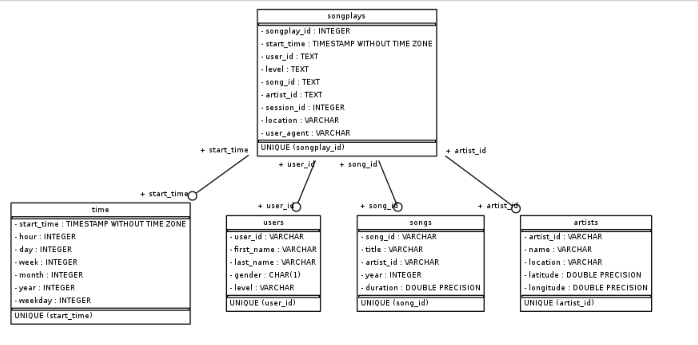
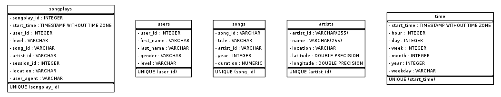

# Project: Data Modeling with Postgres 

This project is part of the Udacity Data Engineering Nanodegree program. 

## Introduction  and Description 

A startup called Sparkify in analyzing their data (songs and user activity stored as JSON files). Sparkify is interested in analyzing what songs users are listening to. 
The dataset for the project is stored in JSON files (song and log files). The Song files will contain the information about the songs and the log file will have the information about the user access log information.

For this project, we will play the role data engineer and be creating a Postgres DB with the available data to facilitate the song play data analysis. Here are the specific goals of the project: 
* Create a database schema and ETL pipeline for the analysis 
   * Please refer to the ER diagram for details:  
* Define FACT and DIMENSION tables for a STAR schema for the analysis 
* Test the DB and ETL 
* Compare my results with the expected results.

## Database Schema Deign and ETL pipeline

*  Identify the  FACT (songplays) and 4 Dimension (users, time, songs, artists) tables. See the following diagram for details: 
(Thanks to the Udacity mentor for sharing the figure)
*  Use postgres to create the database. The scheme that we will be using is STAR schema.
*  Use Python code to create, add and modify the database 
*  Test the changes 
*  Carry out the analysis to compare the results

## Extraction Transformation Loading (ETL) Process
* The code will import all the song related information (`data/song_data`) from the dimension tables, songs, and artists. It will then continue to read the log files (from the `data/log_files` folder).  

## Project Repository Files 
* data directory: Contains two sub-directories, `log_data` and `song_data`. The sub-directories contain other directories and files (`log_data`: log files; `song_data`: song related files)
* Python files: `create_tables.py` and `etl.py`
* Python notebooks: `etl.ipynb` (for ETL) and `test.ipynb` (testing)

## How to run the project?
* Clone this repository 
* Open a terminal and type the following commands: 
  `python create_tables.py`
  `python etl.py`
* Run and check the two notebooks, `etl.ipynb` and `test.ipynb`

## Acknowledgements:
* Udacity Mentors
